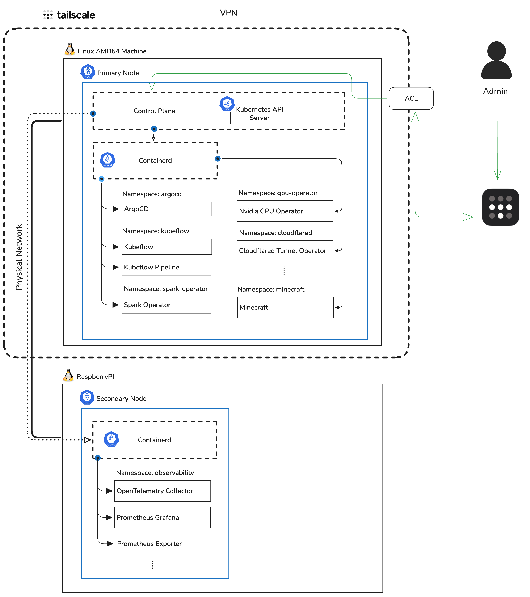
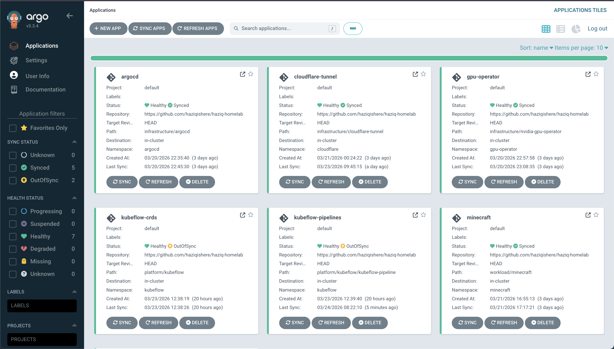

# haziq-homelab

A GitOps-managed Kubernetes homelab built on k3s, purpose-built for data/ML workloads and personal projects.

---

## Hardware

| Component | Spec |
|-----------|------|
| CPU | Intel i5 |
| GPU | NVIDIA GTX 1060 3GB |
| RAM | 16GB |
| Boot | 250GB SSD (`/`) |
| Storage | 500GB HDD (`/mnt/obj-storage`) |
| OS | Arch Linux |
| Network | Tailscale VPN + Wake-on-LAN |

---

## Architecture

All cluster state is managed via ArgoCD — the only manual steps are one-time bootstrapping (ArgoCD install + secrets). After that, every change is via git and PR.



```
MacBook (write manifests + run bootstrap)
        │
        ├── git push → GitHub → ArgoCD watches → applies to k3s
        │
        └── kubectl (over Tailscale) → k3s directly
```


| Service | Access Method |
|---------|--------------|
| Minecraft | Cloudflare Tunnel (public) |
| ArgoCD | Tailscale only |
| Kubeflow | Tailscale only |
| Grafana | Tailscale only |

---

## Running Applications



| Application | Namespace | Status | Path |
|-------------|-----------|--------|------|
| argocd | argocd | Healthy / Synced | `infrastructure/argocd` |
| cloudflare-tunnel | cloudflare | Healthy / Synced | `infrastructure/cloudflare-tunnel` |
| gpu-operator | gpu-operator | Healthy / Synced | `infrastructure/nvidia-gpu-operator` |
| kubeflow-crds | kubeflow | Healthy / OutOfSync | `platform/kubeflow` |
| kubeflow-pipelines | kubeflow | Healthy / OutOfSync | `platform/kubeflow/kubeflow-pipeline` |
| minecraft | minecraft | Healthy / Synced | `workload/minecraft` |

---

## Repo Structure

```
haziq-homelab/
├── bootstrap/                  # One-time setup scripts (run from MacBook)
│   ├── install-argocd.sh
│   └── apply-secrets.sh
│
├── infrastructure/             # Core cluster components (ArgoCD managed)
│   ├── argocd/
│   ├── cloudflare-tunnel/
│   └── nvidia-gpu-operator/
│
├── platform/                   # Data/ML platform operators
│   ├── spark-operator/
│   └── kubeflow/
│
├── workload/                   # Application workloads
│   └── minecraft/
│
├── secrets/                    # Templates only — no real values committed
└── docs/
```

---

## Bootstrap (Fresh Cluster Setup)

```bash
# 1. Install ArgoCD
kubectl apply -k infrastructure/argocd/

# 2. Apply secrets (one-time)
bash bootstrap/apply-secrets.sh

# 3. Create ArgoCD applications pointing at this repo
#    ArgoCD will reconcile everything else automatically
```

---

## Roadmap

### Phase 1 — Core Platform 
- [x] k3s single-node control plane
- [x] kubectl access from MacBook over Tailscale
- [x] ArgoCD (GitOps)
- [x] Cloudflare Tunnel
- [x] NVIDIA GPU operator (GTX 1060 / CUDA)

### Phase 2 — Data Platform 
- [x] Kubeflow Pipelines (lightweight install)
- [x] Spark Operator
- [ ] Minecraft server (public via Cloudflare Tunnel)

### Phase 3 — Expand (When 16GB RAM arrives)
- [ ] Prefect (self-hosted)
- [ ] SeaweedFS (local object storage on `/mnt/obj-storage`)
- [ ] Raspberry Pi 5 as k3s worker node

### Phase 4 — Observability
- [ ] Grafana + Prometheus
- [ ] OpenTelemetry collector
- [ ] Loki for log aggregation

---

## Secrets Strategy

All secrets are managed as Kubernetes Secrets, **never committed to git**.

| Secret | How |
|--------|-----|
| AWS IAM credentials | `kubectl create secret generic aws-creds --from-literal=...` |
| Cloudflare Tunnel token | `kubectl create secret generic cloudflare-token --from-literal=...` |
| ArgoCD admin password | Auto-generated on install |
| ghcr.io pull secret | `kubectl create secret docker-registry ghcr-secret ...` |

`secrets/` contains example templates only. Real values are applied manually via `bootstrap/apply-secrets.sh`.
